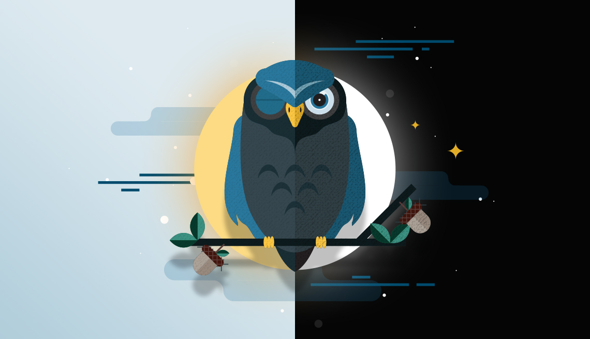

# Hey there, 

I'm Sepehr Eslami, a Self-taught :man_technologist: C++ programmer and a :racing_car: Competitive Programming enthusiast.

I code to make my life easy. Bugs exist to make my life hard. Surprisingly that makes a perfect balance!

A little Extra info about me:

```
class Me
{
    string pronoun = "he" + "/" + "him";
    string languages[] = {"C++", "C"};
    int age = 15;

    string fisrtCode = "Hello World!";

    bool using_namespace_std = true;

    string tools[] = {"CMake", "Make", "Git"};
};
```

## :wrench: Tech & Tools


